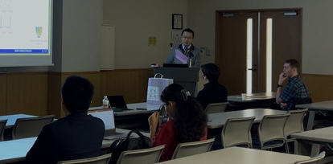
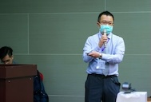
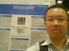

學術活動
=====

.. _biography:

林醫師是IEEE高級會員，也曾是歐洲磁共振醫學與生物學學會（ESMRMB）的成員。他在該領域持續的工作使他獲得了認可。
林醫師的研究主要集中在以下幾個領域：

* 醫學影像處理中的計算方法與演算法開發。
* MRI影像重建與優化技術。
* 診斷放射學中醫學物理的應用。
* 動態主動脈造影。

您可以在Google Scholar、IEEE Xplore或PubMed等找到他的相關發表研究。

    
除了研究工作，林醫師持續協助審稿臨床科技與醫學相關期刊，包括(但不限於)下列期刊:

* IEEE TCI, TIP
* Journal of Clinical Medicine
* BMC Nursing
* Sensors
* Tomography
* Journal of Imaging
* Diagnostics
* Applied Sciences
* Physics in Medicine and Biology
* Animals
* Applied System Innovation
* International Journal of Environmental Research and Public Health
* Medical Physics
* ISMRM, ESMRMB

   
* 新加波國際會議發表海報

   
* 多倫多國際會議發表研究

   
* 與GE MRI研究員合照

* 中研院演講 (https://www.citi.sinica.edu.tw/main/event-seminars/IZ200009)

