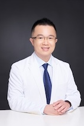

林智敏醫學博士
========

學歷
----

* 台大醫學士
* PhD University of Cambridge

經歷
----

* 前衛生署嘉義醫院住院醫師
* 馬偕醫院住院醫師
* 杜克大學醫學中心研究員（研究助理）
* 晴朗診所兼任主治醫師
* 中壢長榮醫院報備支援醫師
* 101診所報備支援醫師
* 景美醫院兼任主治醫師
* Addenbrooke's Hospital研究醫師
* UCL GOSH research associate 
* Grenoble CDD
* 國際醫學磁振造影學會受訓會員 
* 歐洲醫學與生物磁振造影學會前會員 
* 電機電子工程師學會高級會員 

服務內容
-------

* 高血壓，高血脂，失眠，感冒，體重管理
* 社區醫學服務
* 預防醫學
* 一般體檢
* 健檢諮詢
* 營養，生活型態與健康促進
* 戒菸、早期腎臟病、疫苗注射、預立醫囑諮商。
