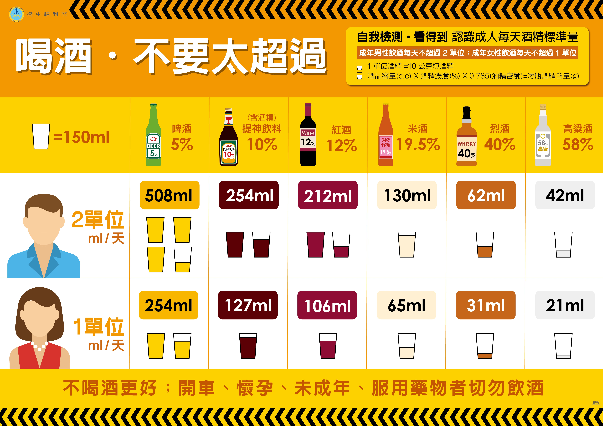

有害物質
=====

.. _drugs:

酒精
-----------

* 適量飲酒為社交不可或缺，也是飲食文化重要的部分。

* 過度飲用酒精會造成健康隱憂。

* 酒精標準量資訊圖表（來源：衛福部心理健康司）（https://dep.mohw.gov.tw/DOMHAOH/cp-4102-43385-107.html）

   
吸菸
------------
* 一根香菸等於減壽7~20分鐘(男性17分鐘，女性22分鐘)，每天一包煙造成的壽命影響可想而知。

* 吸菸損失的是健康的壽命，而不是總年齡。

* 許多人無法戒菸，是因為認為吸菸舒緩身心壓力。然而長期吸菸反而會加重身心壓力，抽菸舒緩是止癮的一種行為。要斷根只能靠戒菸。

* 戒菸時，癮頭上來的身心不舒服，可採用喝茶，轉移注意力舒緩。

* 許多藥物可舒緩戒菸的不適。可至醫療院所醫師開立藥品。

* 一天抽一包煙，每年多付出三萬六千多元以上，不如戒菸省錢。

* 及早戒菸對健康有益。

* 若長期吸菸者(或接觸二手菸者)，建議做LDCT並提早發現腫瘤。

* 電子煙並不健康，有案例顯示電子煙會造成肺部纖維化，甚至發炎等危害。

* 職場健康未來會越來越受到政府重視。職場以吸菸作為社交的工具，其實是不可取的。

* 抽菸造成社會危害，雖然有所謂菸捐，然而造成家庭，社會，健保嚴重負擔。

* 戒菸會變胖嗎？若戒菸同時有減重的需求，可諮詢醫師開立藥物。

